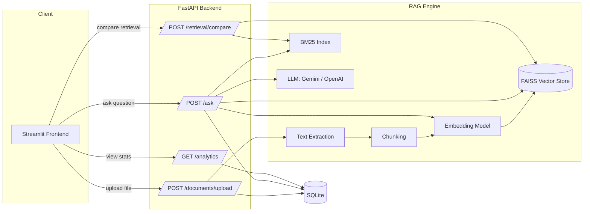
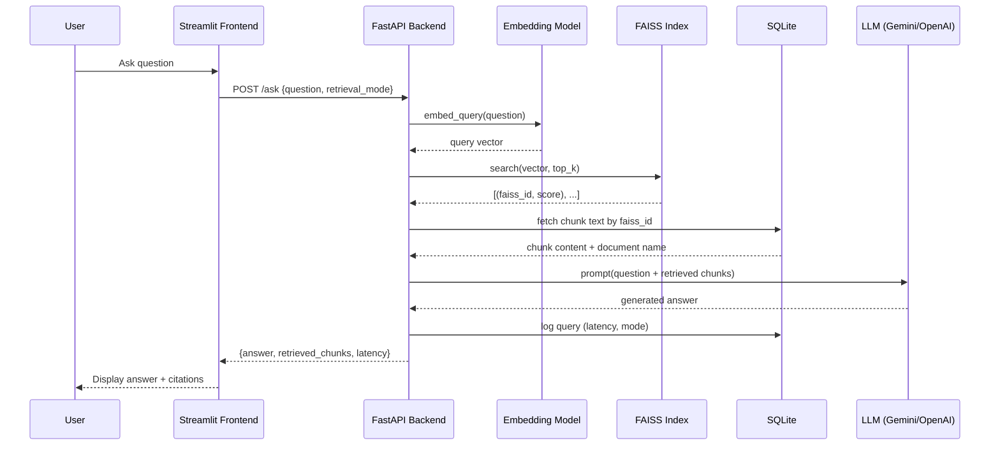
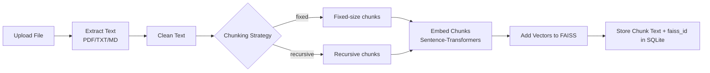

# 🧠 Enterprise Knowledge Assistant (RAG)

A Retrieval-Augmented Generation (RAG) system that lets users upload
company documents (PDF, TXT, Markdown) and ask natural-language
questions about them — with every answer backed by **citations** to the
exact source document and chunk.

Built as a focused, defensible portfolio project: small tech stack,
clear architecture, and every design decision documented and explained
below.

---

## Table of Contents

- [Project Overview](#project-overview)
- [Features](#features)
- [Architecture](#architecture)
- [Tech Stack](#tech-stack)
- [Installation](#installation)
- [Usage](#usage)
- [Project Structure](#project-structure)
- [Design Decisions](#design-decisions)
- [Future Improvements](#future-improvements)
- [Screenshots](#screenshots)
- [Demo / Deployment](#demo--deployment)

---

## Project Overview

Large organizations accumulate huge volumes of unstructured knowledge —
policy documents, manuals, research reports, onboarding guides — that
are scattered across drives and hard to search. Traditional keyword
search (Ctrl+F, basic full-text search) fails when employees phrase
questions differently than the document's wording ("How do I reset my
password?" vs. a document titled "Identity Portal Recovery Procedure").

**This project solves that with RAG**: it retrieves the most relevant
pieces of the organization's own documents for a given question, and
feeds them to an LLM as grounding context. The LLM then answers using
*only* that context, with citations back to the source — dramatically
reducing hallucination compared to asking an LLM a question with no
context at all.

This is the same architectural pattern used by real enterprise products
like Glean, Notion AI, and Microsoft Copilot for internal knowledge
search — implemented here at a scale and complexity appropriate for a
single student to build, understand, and defend.

---

## Features

- **Document Upload** — PDF, TXT, and Markdown files, with metadata
  (filename, upload date, character count) stored in SQLite.
- **Configurable Chunking** — choose between **fixed-size** chunking and
  **recursive** (paragraph/sentence-aware) chunking, with overlap to
  preserve context across chunk boundaries.
- **Semantic Embeddings** — chunks are embedded with a local
  Sentence-Transformers model (`all-MiniLM-L6-v2`), producing
  384-dimensional vectors.
- **Vector Search via FAISS** — fast, in-process cosine-similarity
  search over all chunk embeddings.
- **RAG Question Answering** — full pipeline: embed query → retrieve
  top-k chunks → build grounded prompt → call LLM (Gemini or OpenAI) →
  return answer.
- **Citations** — every answer shows which document(s) and chunk
  number(s) the answer was based on, with the raw retrieved text
  visible for verification.
- **Retrieval Comparison** — a dedicated page that runs the same query
  through **vector search** and **BM25 keyword search** side by side,
  so you can directly compare semantic vs. lexical retrieval.
- **Analytics Dashboard** — document count, chunk count, total queries,
  average retrieval+generation latency, and a log of recent queries.

---

## Architecture

### System Overview



### RAG Question-Answering Pipeline



### Document Ingestion Pipeline



---

## Tech Stack

| Layer            | Technology                          | Why                                                                                                   |
|-------------------|--------------------------------------|--------------------------------------------------------------------------------------------------------|
| Backend API       | **FastAPI**                          | Async-capable, auto-generated OpenAPI docs, strong typing via Pydantic, industry-standard for Python APIs. |
| Vector Search     | **FAISS** (`IndexFlatIP`)             | Runs in-process with zero infrastructure; exact cosine similarity is plenty fast at this data scale.   |
| Embeddings        | **Sentence-Transformers** (`all-MiniLM-L6-v2`) | Small, CPU-friendly, no per-call cost, strong semantic quality for English text.                |
| Keyword Retrieval | **BM25** (`rank_bm25`)                | Classic IR baseline; enables a meaningful retrieval comparison feature.                                |
| Database          | **SQLite**                            | Zero-config, file-based, real SQL for metadata — perfect for a single-user / small-scale deployment.   |
| Frontend          | **Streamlit**                         | Fast to build a usable UI in pure Python; trivial to deploy.                                            |
| LLM               | **Gemini API** or **OpenAI API**      | Pluggable via config; Gemini's free tier suits a student budget.                                       |
| Containerization  | **Docker / docker-compose**           | Reproducible environments; required for most deployment platforms.                                     |
| Testing           | **pytest**                            | Standard Python testing framework; used for unit tests on core RAG logic.                              |
| CI                | **GitHub Actions**                    | Automatically runs tests on every push/PR.                                                              |

---

## Installation

### Prerequisites
- Python 3.11+
- (Optional) Docker & Docker Compose
- A Gemini or OpenAI API key

### Local Setup

```bash
# 1. Clone the repository
git clone https://github.com/<your-username>/enterprise-knowledge-assistant.git
cd enterprise-knowledge-assistant

# 2. Create a virtual environment
python -m venv venv
source venv/bin/activate   # On Windows: venv\Scripts\activate

# 3. Install dependencies
pip install -r requirements.txt

# 4. Configure environment variables
cp .env.example .env
# Edit .env and add your GEMINI_API_KEY (or OPENAI_API_KEY)

# 5. Run the backend API
uvicorn backend.main:app --reload --port 8000

# 6. In a second terminal, run the frontend
streamlit run frontend/app.py
```

### Docker Setup

```bash
docker compose up --build
```

- Frontend: http://localhost:8501
- Backend API docs (Swagger UI): http://localhost:8000/docs

---

## Usage

1. **Upload Documents** — Go to the "Upload Documents" page and upload
   one or more PDF/TXT/Markdown files. Try the sample files in
   `assets/sample_docs/`.
2. **Ask a Question** — Go to the "Ask a Question" page, type a
   question, and choose a retrieval mode (`vector` or `bm25`). The
   answer is displayed along with the exact source chunks used.
3. **Retrieval Comparison** — Go to the "Retrieval Comparison" page to
   see how vector search and BM25 rank chunks differently for the same
   query.
4. **Analytics** — Go to the "Analytics" page to see document/chunk
   counts, total queries, and average latency.

### Example (using the sample documents)

> "How many days of annual leave do employees get?"
> → Answer cites `employee_handbook.md`, chunk #0.

> "What should I do if I lose my company laptop?"
> → Answer cites `it_security_policy.txt`, chunk #2.

---

## Project Structure

```
enterprise-knowledge-assistant/
│
├── backend/              # FastAPI app, configuration, logging
│   ├── main.py           # API routes
│   ├── config.py         # Centralized settings (env-driven)
│   └── logger.py         # Logging setup
│
├── frontend/             # Streamlit UI
│   └── app.py
│
├── rag/                  # Core RAG engine (framework-agnostic)
│   ├── extraction.py     # PDF/TXT/MD text extraction + cleaning
│   ├── chunking.py        # Fixed-size + recursive chunking strategies
│   ├── embeddings.py      # Sentence-Transformers wrapper
│   ├── vector_store.py    # FAISS index wrapper
│   ├── bm25_search.py     # BM25 keyword retrieval
│   ├── llm.py             # Gemini/OpenAI adapter
│   └── qa_pipeline.py     # Orchestrates ingestion + Q&A pipelines
│
├── database/             # SQLite schema + data-access layer
│   ├── schema.sql
│   └── db.py
│
├── tests/                # pytest unit tests
│
├── docs/                 # Interview prep & resume materials
│   ├── implementation_plan.md
│   ├── interview_prep.md
│   └── resume_points.md
│
├── assets/sample_docs/   # Example documents for testing
│
├── .github/workflows/    # CI pipeline
├── Dockerfile             # Backend image
├── Dockerfile.frontend    # Frontend image
├── docker-compose.yml
├── requirements.txt
├── .env.example
└── README.md
```

**Why this structure?** The `rag/` package contains all RAG logic with
**no FastAPI or Streamlit imports** — it's pure Python that could be
reused in a CLI tool, a Jupyter notebook, or a different web framework.
`backend/` and `frontend/` are thin layers on top of `rag/` and
`database/`. This separation of concerns is a key thing interviewers
look for.

---

## Design Decisions

### Why RAG?
LLMs can't answer questions about private/internal documents they were
never trained on, and fine-tuning a model for every document update is
slow and expensive. RAG retrieves relevant context *at query time* and
injects it into the prompt — no retraining needed, and answers are
grounded in up-to-date, verifiable source documents.

### Why FAISS?
FAISS provides production-grade similarity search algorithms but runs
in-process with no external service — ideal for a project that must be
free to host. `IndexFlatIP` (exact search) is simple to explain and, for
the dataset sizes here (hundreds–thousands of chunks), just as fast in
practice as approximate methods.

### Why Embeddings?
Embeddings convert text into vectors where semantic similarity ≈
geometric closeness, enabling search by *meaning* rather than exact
keyword match. This lets users phrase questions naturally.

### Why Citations?
Citations are the core mechanism that makes RAG trustworthy. Without
them, an LLM's answer is a black box; with them, a user can verify the
claim against the source document — critical in enterprise settings
(legal, compliance, HR).

### Why SQLite?
SQLite gives real relational queries (joins between documents and
chunks, aggregate analytics) with zero setup. For a single-user or
small-team deployment, a separate database server would be unnecessary
operational overhead.

---

## Future Improvements

These are intentionally **not implemented**, to keep the project focused
— but are natural "next steps" to discuss in interviews:

- **PostgreSQL** — for multi-user concurrent access and larger datasets.
- **Reranking** — use a cross-encoder model to re-score the top-N
  retrieved chunks for higher precision before sending to the LLM.
- **Hybrid Retrieval** — combine vector and BM25 scores (e.g. weighted
  sum or Reciprocal Rank Fusion) instead of choosing one.
- **Enterprise Authentication** — SSO/OAuth so different users/teams see
  only the documents they're authorized to access.
- **Approximate FAISS indexes** (e.g. `IndexHNSWFlat`, `IndexIVFFlat`)
  for scaling to millions of chunks.
- **Background ingestion** — move document processing to a task queue
  for large files instead of blocking the upload request.

---

## Screenshots

> _Add screenshots after running the app locally:_

- `assets/screenshots/ask_question.png` — Ask a Question page
- `assets/screenshots/upload.png` — Upload Documents page
- `assets/screenshots/comparison.png` — Retrieval Comparison page
- `assets/screenshots/analytics.png` — Analytics dashboard

---

## Demo / Deployment

### Deploying the Backend (Render / Railway)
1. Push this repo to GitHub.
2. Create a new Web Service, point it at this repo, and select
   "Docker" as the environment (it will use `Dockerfile`).
3. Add environment variables from `.env.example` (especially
   `GEMINI_API_KEY` or `OPENAI_API_KEY`) in the platform's dashboard.
4. Mount a persistent disk at `/app/data` so the SQLite DB and FAISS
   index survive restarts.

### Deploying the Frontend (Streamlit Community Cloud / HuggingFace Spaces)
1. Set `API_URL` to the deployed backend's public URL.
2. Point the deployment at `frontend/app.py` as the entry point.

---

## License

MIT — feel free to fork and adapt for your own portfolio.
